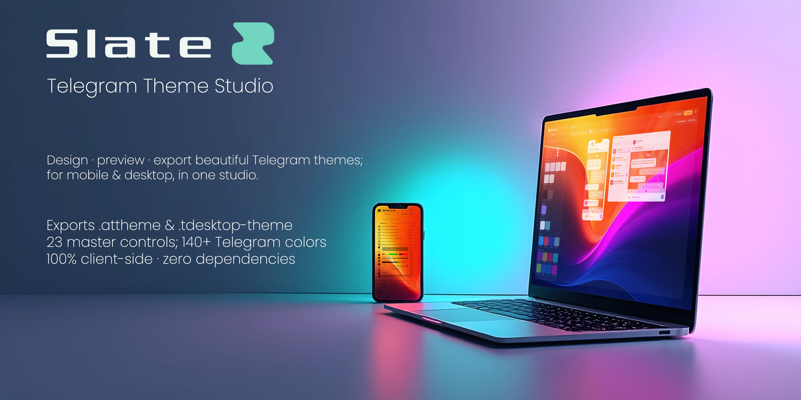
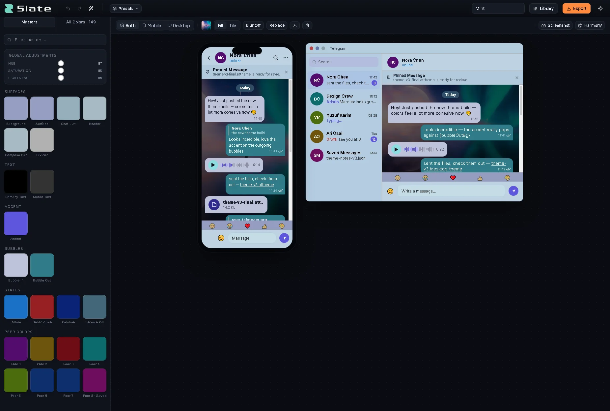
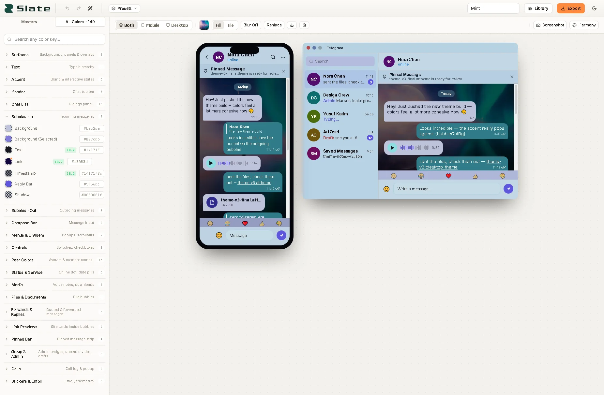
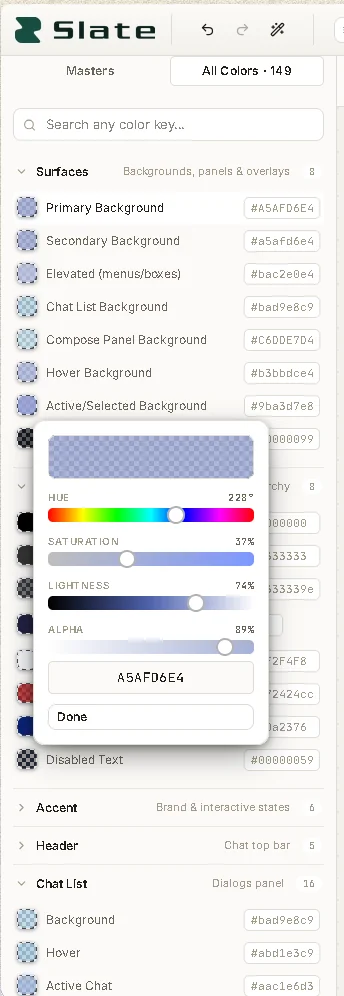
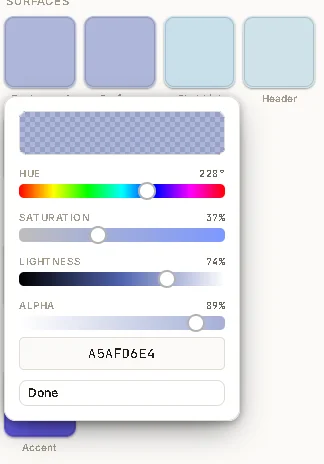
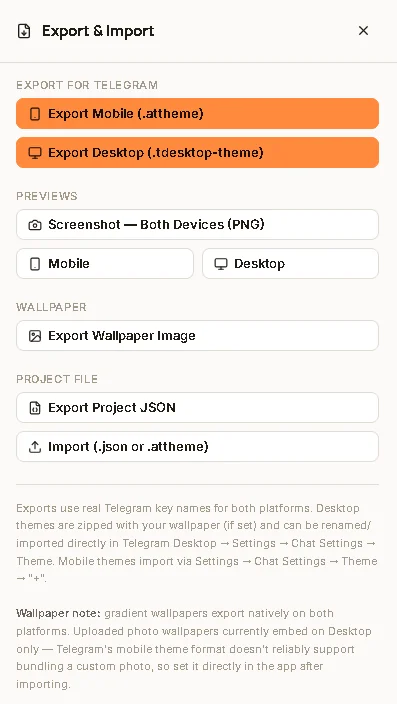
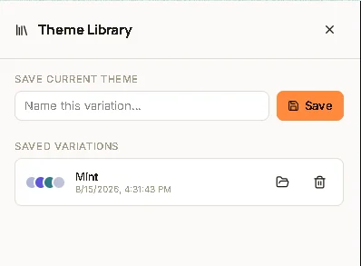

<div align="center">

# Slate: Telegram Theme Studio

**Design, preview and export Telegram themes — for mobile *and* desktop — in one place.**

[](LICENSE)
[](https://www.typescriptlang.org/)
[](https://react.dev/)
[](package.json)



</div>

Slate is a browser-based studio for crafting Telegram themes. Start from 23
master color controls and watch a full semantic palette of **140+ real Telegram
colors** derive live, preview the result in pixel-accurate mobile and desktop
mockups, then export to the actual formats Telegram accepts — no accounts, no
server, no data leaves your machine.

Everything runs locally: the color engine, the ZIP writer, the exporters and
the screenshot capture are all hand-rolled with **zero runtime dependencies**.

## Features

- **Master-driven color system** — tweak 23 master controls (`bg`, `accent`,
  `text`, …) and every derived semantic color updates in real time. No need to
  hand-tune 140+ keys.
- **Pixel-accurate previews** — side-by-side (or solo) mobile and desktop
  Telegram mockups driven entirely by the live palette, so what you see is
  what gets exported.
- **Wallpaper engine** — upload a photo (crop to 16:9 in-app) or build a
  two-stop gradient with angle control; choose fill, tile or blur modes.
- **Global adjustments** — non-destructive hue / saturation / lightness
  tweaks over the whole theme, with a one-click *bake* into the palette.
- **Color harmony & inspiration** — harmony presets and a shuffle generator
  to jump-start new palettes.
- **Real Telegram export** — `.attheme` for Android, `.tdesktop-theme`
  (zipped with wallpaper) for Desktop, plus `.slate.json` project files.
- **Import** — open `.slate.json` projects or parse an existing `.attheme`.
- **Theme library** — save themes with autosave to `localStorage`.
- **Undo / redo** — history with smart batching while dragging sliders.
- **High-res screenshots** — export the preview as a crisp 3× PNG straight
  from the stage toolbar (or export just the wallpaper image).

## Demo

[Slate-demo.webm](https://github.com/user-attachments/assets/c0fb656a-e6be-4838-84cb-0b549191c8f6)


## Screenshots

| Mobile preview (dark) | Desktop preview (light) |
| --- | --- |
|  |  |

| All colors | Custom color picker |
| --- | --- |
|  |  |

| Export panel | Theme library |
| --- | --- |
|  |  |


## Quick start

Requires Node.js 16+.

```bash
git clone https://github.com/mh3nj/slate.git
cd slate
npm install
npm start
```

Open [http://localhost:3000](http://localhost:3000) — the dev server
hot-reloads on save.

> **Windows note:** the repo is developed in Git Bash; all scripts are
> POSIX-compatible. If you use PowerShell, prefix commands with
> `bash -c "…"` where needed.

## Using the studio

1. **Masters tab** — the 23 master controls are the heart of the palette.
   Drag any of them and the entire theme re-derives instantly.
2. **Previews** — toggle mobile / desktop / both. Everything you see is
   generated from the live palette.
3. **Wallpaper** — drop in a photo (crop it to 16:9) or create a gradient.
   Pick fill / tile / blur and watch the preview update.
4. **Adjust & inspire** — apply global HSL adjustments, try harmony presets,
   or hit *shuffle* for a new palette.
5. **Export** — choose your target format and download. Mobile themes export
   as `.attheme`; desktop themes as `.tdesktop-theme` (a ZIP that includes
   the wallpaper); projects save as `.slate.json`.

### Export matrix

| Format | Platform | Contents |
| --- | --- | --- |
| `.attheme` | Android / Telegram mobile | color keys + optional wallpaper |
| `.tdesktop-theme` | Telegram Desktop | ZIP with `colors.tdesktop-theme` + wallpaper |
| `.slate.json` | Slate | full editable project (masters, overrides, wallpaper) |
| PNG (3×) | — | high-res screenshot of the mobile / desktop / both previews |
| PNG / JPEG | — | standalone wallpaper image (1080×2340 gradients, or the original photo resolution) |

## How it works

Slate is a single pipeline:

```text
master colors (23)  →  deriveFullPalette()  →  semantic palette (140+)  →  previews & exports
```

- `src/lib/semantic.ts` expands the 23 masters into every semantic key
  Telegram understands (`windowBg`, `msgOutBg`, `chats_name`, …).
- `src/lib/export.ts` maps semantic keys to the **real** Telegram key names
  for each platform and serializes the final files.
- `src/lib/zip.ts` is a dependency-free ZIP writer (STORE method + CRC32).
- `src/lib/capture.ts` rasterizes the live SVG preview frames to high-res PNG.

## Project structure

```text
src/
├── App.tsx                  # root: state, palette derivation, layout wiring
├── components/
│   ├── preview/             # mobile + desktop Telegram mockups (pixel-accurate)
│   ├── sidebar/             # master controls, global adjustments, full palette
│   ├── ui/                  # buttons, sliders, segmented controls, color popover
│   └── wallpaper/           # wallpaper panel + crop modal
├── hooks/useHistoryState.ts # undo/redo with smart input batching
├── lib/                     # the core: color math, semantic palette, exporters
│   ├── color.ts             # hex/hsl math, contrast
│   ├── semantic.ts          # masters → 140+ semantic colors
│   ├── harmony.ts           # harmony presets & randomization
│   ├── export.ts            # .attheme / .tdesktop-theme serialization + key maps
│   ├── zip.ts               # dependency-free ZIP writer
│   ├── capture.ts           # high-res SVG→PNG preview screenshot capture
│   └── wallpaper.ts         # gradient rasterization + wallpaper export
└── styles/                  # studio design system + preview frame CSS
```

## Scripts

| Command | What it does |
| --- | --- |
| `npm start` | run the dev server with hot reload |
| `npm run build` | create an optimized production build in `build/` |
| `npm test` | run Jest (watch mode) |
| `npm run lint` | lint `src/` with ESLint |
| `npm run release` | build + package `releases/slate-<version>.zip` |

## Technologies

- **React 18 + TypeScript** — strict-mode, component-driven UI.
- **Zero runtime dependencies** — color math, ZIP, export and capture are all
  hand-rolled. Canvas, SVG and the DOM are the only "frameworks".
- **localStorage persistence** — themes autosave locally; nothing is uploaded.

## Contributing

Contributions are welcome — bug reports, feature requests, tests, docs, and
of course themes. Please read [CONTRIBUTING.md](CONTRIBUTING.md) first; the
short version: TypeScript everywhere, no new runtime dependencies, `npx tsc
--noEmit && npm run lint && npm run build` must pass, and tests for anything
in `src/lib/` are especially appreciated.

## Security

Slate runs 100% client-side and exports are generated locally. See
[SECURITY.md](SECURITY.md) for the supported-versions policy and how to report
a vulnerability privately.

## Changelog

See [CHANGELOG.md](CHANGELOG.md) for a full history of changes.

## License

[MIT](LICENSE) © [mh3nj](https://github.com/mh3nj)
